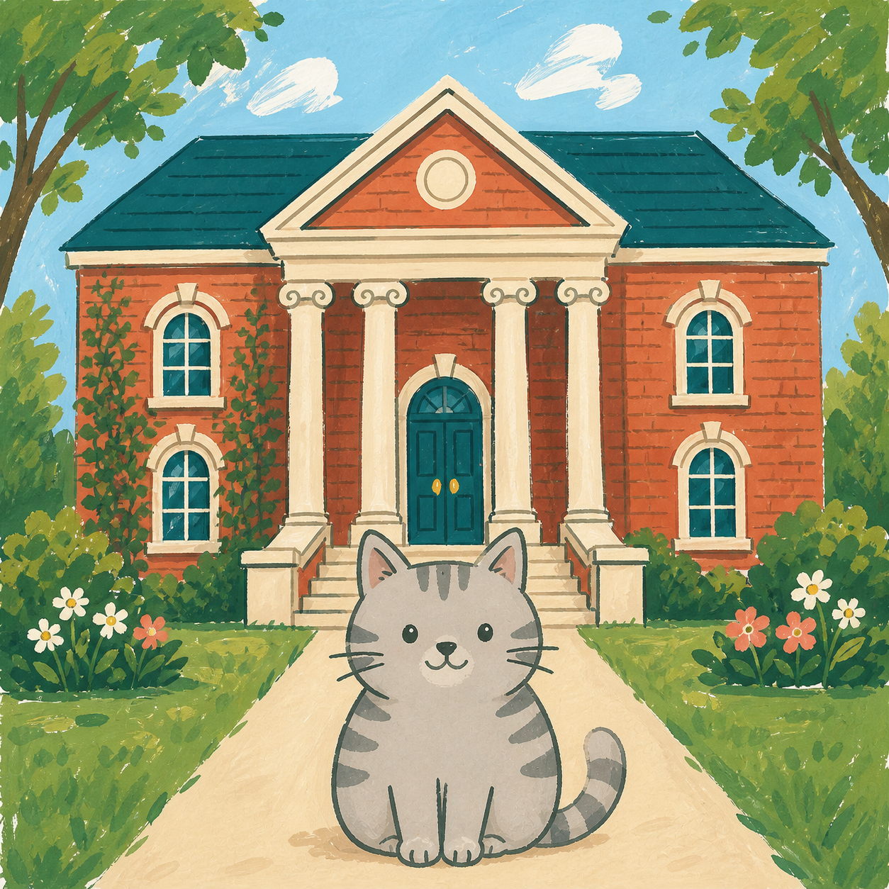
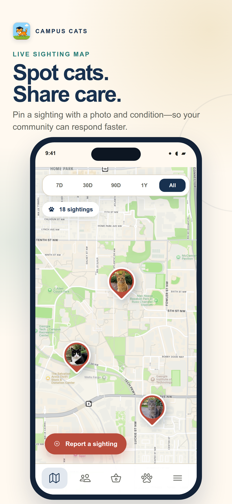
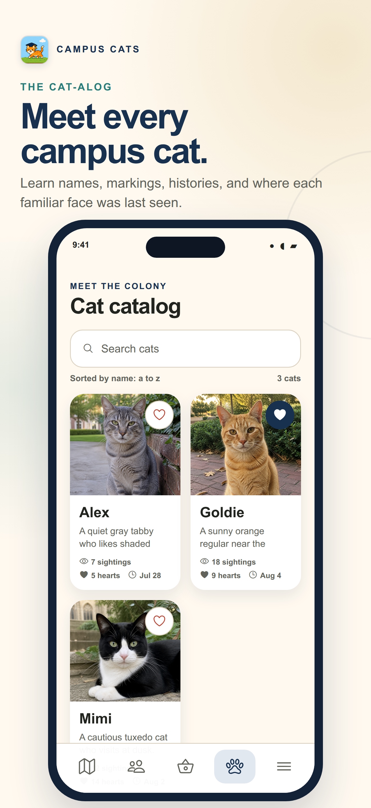
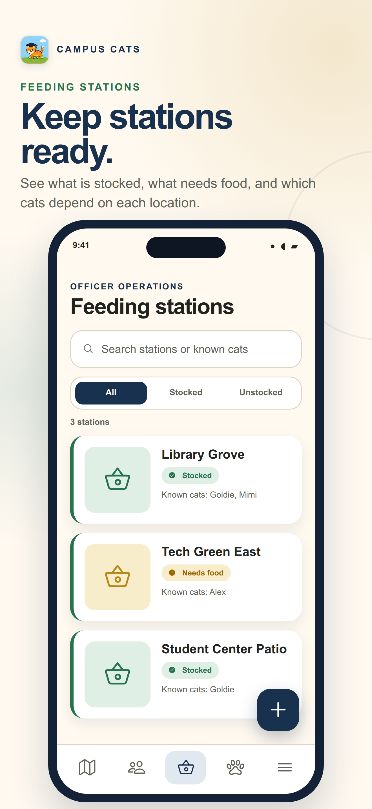
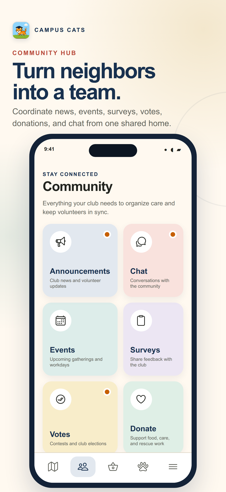

<p align="center">
  
</p>

<h1 align="center">Campus Cats</h1>

<p align="center">
  <strong>The mobile home for campus cat communities.</strong>
</p>

<p align="center">
  Map sightings, care for feeding stations, remember every cat, and bring your whole club together.
</p>

<p align="center">
  
  
  
  <a href="LICENSE"></a>
</p>

Campus cat organizations do far more than leave food outside. They identify cats,
track health and behavior, coordinate volunteers, maintain feeding stations, share
urgent updates, welcome new members, and preserve years of community knowledge.

Campus Cats puts that work in one place. It is an invite-only, configurable platform
where every university club receives its own branded workspace, isolated data, member
community, and operational tools.

## See Campus Cats in action

Select any preview to open the full-size App Store image.

<table>
  <tr>
    <td align="center" width="50%">
      <a href="assets/images/app_previews/01-live-sighting-map.png">
        
      </a>
      <br />
      <strong>Live sighting map</strong>
      <br />
      Pin a cat sighting with its photo and condition so nearby volunteers can respond.
    </td>
    <td align="center" width="50%">
      <a href="assets/images/app_previews/02-cat-catalog.png">
        
      </a>
      <br />
      <strong>Cat-alog</strong>
      <br />
      Learn each cat's name, markings, history, favorites, and recent sightings.
    </td>
  </tr>
  <tr>
    <td align="center" width="50%">
      <a href="assets/images/app_previews/03-feeding-stations.png">
        
      </a>
      <br />
      <strong>Feeding stations</strong>
      <br />
      Track what is stocked, what needs food, and which cats use each location.
    </td>
    <td align="center" width="50%">
      <a href="assets/images/app_previews/04-community-hub.png">
        
      </a>
      <br />
      <strong>Community hub</strong>
      <br />
      Bring announcements, chat, events, surveys, votes, and donations together.
    </td>
  </tr>
</table>

## Everything a campus cat club needs

| Experience           | What it gives your community                                                                                                        |
| -------------------- | ----------------------------------------------------------------------------------------------------------------------------------- |
| **Sightings**        | Photo-backed reports with location, condition, date, discussion, and map filters from the last seven days through all time.         |
| **Cat-alog**         | A visual directory of known cats with identifying details, favorites, tags, photos, and recent sighting history.                    |
| **Feeding stations** | Shared station locations, known cats, restocking details, and stocked or unstocked views for faster volunteer coordination.         |
| **Community**        | Announcements, push notifications, events, surveys, contests, elections, donations, and a live club chat in one place.              |
| **Membership**       | University discovery, club-specific sign-in, email access workflows, role-aware navigation, and deliberate presidential succession. |
| **Moderation**       | Officer pings, chat restrictions, disciplinary notices, account bans, and protected read-only access for restricted members.        |

## One platform, uniquely yours

Campus Cats is designed to scale beyond a single campus without flattening every club
into the same experience.

- **A private workspace for every club.** Content and media live inside isolated club
  boundaries, and signed-in members always resolve to their own organization.
- **University-powered discovery.** Clubs are mapped to a verified U.S. university
  directory so prospective members can find the right community before signing in.
- **Verified club creation.** A school-domain President can request a new club,
  verify ownership by email, and launch a deterministic tenant without exposing
  administrative collections to the client.
- **Club-controlled branding.** Presidents can upload an in-app logo, choose primary
  and accent colors, and preview accessible light and dark themes.
- **Flexible access.** Each club can retain institution-specific authentication while
  supporting tenant-aware email access for other members.
- **Independent subscriptions.** Every club has its own entitlement, usage metering,
  trial, payment status, invoices, and President-managed billing controls.

## Built around real club roles

Campus Cats adapts the experience to the responsibility a person holds.

| Role                    | Focus                                                                                                                 |
| ----------------------- | --------------------------------------------------------------------------------------------------------------------- |
| **Members**             | Report sightings, explore cats, join conversations, attend events, answer surveys, vote, and support the club.        |
| **Officers**            | Publish updates, manage operational content, coordinate volunteers, inspect responses, and moderate community spaces. |
| **Vice-Presidents**     | Inherit officer workflows with broader club administration responsibilities.                                          |
| **Presidents**          | Control club branding, membership leadership, subscription settings, and presidential succession.                     |
| **Platform Developers** | Operate the multi-club service while remaining distinct from each club's internal leadership.                         |

## Designed for responsible community care

- **Privacy-aware contributions:** clubs can keep sighting and catalog contributor
  identities anonymous to ordinary members while preserving owner editing rights and
  officer accountability.
- **Private participation:** anonymous surveys separate answers from member identity,
  and contest ballots remain private until aggregate results are available.
- **Role-enforced operations:** client presentation, trusted server workflows,
  Firestore rules, and Storage rules share the same club and permission boundaries.
- **Safe external enrichment:** optional iNaturalist imports are read-only,
  source-attributed, license-aware, and kept separate from locally reported facts.
- **Account control:** public legal pages, versioned consent, and an in-app account
  deletion workflow support mobile-store and member expectations.
- **Accessible by design:** semantic color roles, light and dark themes, scalable
  typography, reduced motion, and 44-point touch targets shape the shared interface.

## Under the hood

Campus Cats is a native mobile application built with Expo, React Native, TypeScript,
and Expo Router. Firebase provides authentication, tenant-scoped Firestore and
Storage, callable Functions, notifications, and hosted public flows. Stripe powers
club subscriptions and usage billing; SendGrid supports verified invitations and
operational email.

The client is organized into behavior-first feature modules behind typed ports, with
Firebase, Expo, development, and deterministic in-memory adapters. This keeps product
behavior testable while the platform grows across providers and clubs.

### Run locally

```bash
git clone https://github.com/willakins/Campus-Cats.git
cd Campus-Cats
npm ci
npx expo start
```

Authentication, maps, notifications, email, billing, and data-backed features require
their corresponding service configuration. Start with the
[installation guide](Installation-Guide.md) and [testing guide](docs/testing.md).

### Documentation

- [System design](system-design.md)
- [Multi-club subscription architecture](docs/architecture/0003-multi-club-subscription-tenancy.md)
- [University onboarding](docs/university-onboarding.md)
- [Club subscriptions and tenant migration](docs/billing-operations.md)
- [App branding and contributor privacy](docs/app-settings.md)
- [Community engagement](docs/community-engagement.md)
- [iNaturalist integration](docs/inaturalist-import.md)
- [Authorization matrix](docs/architecture/behavior-matrix.md)
- [Campus Field Guide design system](docs/design-system.md)
- [Legal release checklist](docs/legal-release.md)
- [App Store preview source](marketing/app-store/README.md)
- [Contributing](CONTRIBUTING.md)

## Project history

<p align="center">
  
</p>

Campus Cats began as a Georgia Tech Computer Science capstone project built for the
Georgia Tech Campus Cats organization. The original five-person team translated the
club's real-world caregiving and coordination needs into the first single-club mobile
release:

- [Amulya Panakam](https://github.com/apanakam7)
- [Dragos Lup](https://github.com/Dragos-Lup)
- [Matthew Pendarvis](https://github.com/mattpendarvis)
- [Robert Zhu](https://github.com/ArchWand)
- [William Akins](https://github.com/willakins)

After the capstone, **William Akins became the project's sole developer and
maintainer**. He is now evolving Campus Cats from that original deployment into the
configurable, multi-club platform described above—expanding its architecture,
community features, onboarding, branding, privacy, moderation, billing, and release
operations while preserving the foundation created by the full capstone team.

The original [detailed design document](Detailed%20Design%20Document.pdf),
[version 1.0 release notes](CHANGELOG.md), and
[contributor history](https://github.com/willakins/Campus-Cats/graphs/contributors)
preserve that early chapter of the project. Campus Cats is an independent product and
does not imply institutional endorsement by Georgia Tech.

## License

Licensed under the [Apache License 2.0](LICENSE).
