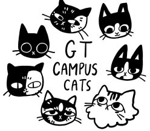
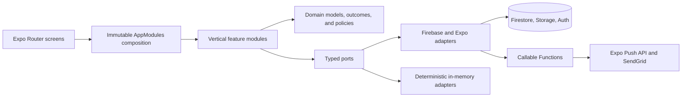

<p align="center">
  
</p>

<h1 align="center">Campus Cats</h1>

<p align="center">
  A cross-platform operations hub for the community caring for Georgia Tech's campus cats.
</p>

<p align="center">
  
  
  
  
  <a href="LICENSE"></a>
</p>

> [!NOTE]
> Campus Cats was created by a five-person Georgia Tech Computer Science capstone team for the Campus Cats client. This repository represents the team's collective work; contributors are credited below.

## The project

Georgia Tech's Campus Cats volunteers care for a population of stray and feral cats across campus. Without a shared system, sightings, cat histories, feeding-station status, and time-sensitive updates can become fragmented across people and channels.

Campus Cats brings those workflows into one mobile experience. Members can record photo-backed sightings on a live map, learn about known cats, and receive club announcements. Officers can maintain the shared data, coordinate station restocking, and manage community access.

## What we built

| Experience                     | What it enables                                                                                                                                 |
| ------------------------------ | ----------------------------------------------------------------------------------------------------------------------------------------------- |
| **Live sighting map**          | Report a cat's location, condition, date, and photos; explore sightings with 7-day through all-time filters.                                    |
| **Cat-alog**                   | Maintain a visual directory of known campus cats with profiles, identifying details, and recent sightings.                                      |
| **Feeding stations**           | Track station locations and restocking information, with stocked/unstocked filtering for faster coordination.                                   |
| **Announcements**              | Give officers a central place to publish updates and send push notifications to members.                                                        |
| **Community access**           | Support Georgia Tech SSO, an alumni whitelist workflow, and Firebase-backed authentication.                                                     |
| **Role-aware administration**  | Separate member, officer, Vice-President, President, and developer capabilities, with an atomic presidential succession workflow.               |
| **iNaturalist integration**    | Bring public Georgia Tech project sightings and guide profiles into the existing map and catalog through a daily, attributed, read-only import. |
| **Officer billing**            | Review monthly Firebase and Google Cloud usage, credits, and net app costs from a role-protected screen.                                        |
| **President-managed settings** | Change login branding and accessible app colors, and control whether Campus Cats contributor identities are visible to Members.                 |
| **Member moderation**          | Power-role users can record disciplinary notices and ban or restore Member accounts with Firebase-enforced login blocking.                      |

## Why it stands out

- **Built for a real community partner:** the team translated Campus Cats' caregiving and coordination needs into a working product.
- **End-to-end mobile engineering:** one codebase connects maps, geolocation, image uploads, authentication, cloud data, notifications, and email workflows.
- **Thoughtful permission design:** navigation and editing controls adapt to user roles, while report owners retain control over their own submissions.
- **Cross-platform delivery:** Expo and React Native provide a shared foundation for iOS, Android, and web targets.
- **Collaborative execution:** five developers worked through iterative sprints on a layered, service-oriented application.

## Architecture



The client is organized as behavior-first vertical modules for sightings, catalog,
stations, announcements, contacts, users, whitelist, session, image selection, and
iNaturalist integration workflows.
Screens own presentation and navigation; modules return typed outcomes; narrow ports
isolate Firebase and Expo. Deterministic in-memory adapters and Firebase Emulator
contracts protect behavior during refactors. See the
[architecture decision](docs/architecture/0001-feature-modules.md) for the dependency
rules and compatibility constraints.

### Technology

| Area                    | Tools                                                                    |
| ----------------------- | ------------------------------------------------------------------------ |
| Client                  | React Native, Expo, Expo Router                                          |
| Language and validation | TypeScript, React Hook Form, Zod                                         |
| Location and media      | React Native Maps, Expo Location, Expo Image Picker                      |
| Backend                 | Firebase Authentication, Cloud Firestore, Cloud Storage, Cloud Functions |
| Communication           | Expo Notifications, Expo Push API, SendGrid                              |
| Tooling                 | ESLint, Jest Expo                                                        |

## Run it locally

```bash
git clone https://github.com/willakins/Campus-Cats.git
cd Campus-Cats
npm ci
npx expo start
```

The interface can be explored locally, but authentication, maps, notifications, email, and data-backed features depend on their corresponding service configuration and access. See the [installation guide](Installation-Guide.md) for platform options, configuration notes, and troubleshooting.

## Project documentation

- [Installation guide](Installation-Guide.md)
- [Release notes](CHANGELOG.md)
- [Detailed design document](Detailed%20Design%20Document.pdf) — the team's original capstone design artifact; it includes planned ideas beyond the final v1 scope
- [Firebase operations](FIREBASE.md)
- [Architecture](docs/architecture/0001-feature-modules.md)
- [Authorization matrix](docs/architecture/behavior-matrix.md)
- [Campus Field Guide design system](docs/design-system.md)
- [iNaturalist import and operations](docs/inaturalist-import.md)
- [App Billing operations](docs/billing.md)
- [App settings and contributor privacy](docs/app-settings.md)
- [Testing guide](docs/testing.md)
- [Contributing](CONTRIBUTING.md)

## Team

Developed collaboratively by the following Georgia Tech students (listed alphabetically):

- [Amulya Panakam](https://github.com/apanakam7)
- [Dragos Lup](https://github.com/Dragos-Lup)
- [Matthew Pendarvis](https://github.com/mattpendarvis)
- [Robert Zhu](https://github.com/ArchWand)
- [William Akins](https://github.com/willakins)

The repository's [contributor history](https://github.com/willakins/Campus-Cats/graphs/contributors) provides an additional view of the team's work. Git author aliases may cause one person to appear more than once.

## Project status

The repository contains the team's completed capstone release. Review the [release notes](CHANGELOG.md) for shipped functionality and known limitations. Service-backed features may require credentials or organization-level access that are not available to external evaluators.

## License

Licensed under the [Apache License 2.0](LICENSE).
