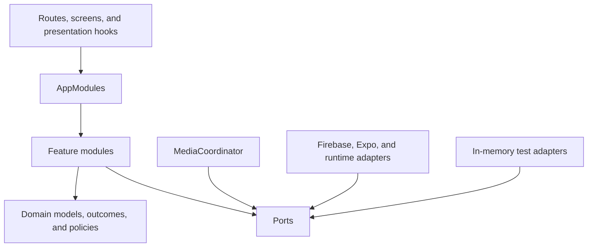

# ADR 0001: Behavior-first feature modules

- Status: Accepted
- Date: 2026-08-03
- Tracking issue: [#129](https://github.com/willakins/Campus-Cats/issues/129)

## Context

Campus Cats grew quickly during a Georgia Tech capstone. Its screens currently call a
singleton database facade whose services also own navigation, React state setters,
alerts, Firebase access, validation, and selected-record globals. This makes ordinary
behavior difficult to test and makes a change in one feature risky for unrelated
features.

The refactor must preserve the production Firestore collections, document fields,
Storage paths, routes, and visible behavior. It must not require a production-data
migration.

## Decision

The application will expose an immutable `AppModules` composition root. It contains
explicit modules for sightings, catalog, stations, announcements, contacts, users,
whitelist, session, and image selection.

Each module presents typed query and mutation methods and returns `Outcome<T>` values.
Module interfaces never accept React setters, routers, alerts, or Firebase SDK types.
Screens and presentation hooks own loading state, confirmations, error display, and
navigation.

Firebase Auth, Firestore, Storage, callable functions, image picking, time, IDs, and
password generation live behind narrow ports. Production adapters use Firebase and
Expo; deterministic in-memory adapters support behavior tests. Contract suites verify
that in-memory and emulator-backed adapters agree.

Domain values are immutable and parsed by canonical Zod schemas. Firestore codecs own
the mapping between persisted documents and domain values. Routes pass record IDs and
load by ID instead of sharing selected objects through module globals.

Media operations share one reconciliation workflow. Stored image identity is opaque;
business code does not recover storage paths by parsing download URLs. Multi-product
operations define compensation behavior for partial failures.

## Consequences

- Features are migrated vertically and composed once in `composition/appModules.ts`.
- The old singleton facade, persistence services, selected-record stores, duplicate
  class models, and image-handler hierarchy have been removed.
- Tests describe caller-visible behavior at module, adapter-contract, route, callable,
  and security-rule seams.
- Dependency direction is presentation → application/domain → ports, with adapters
  implementing ports at the edge.
- Adding a generic repository, command bus, Redux store, or query cache requires a
  separate demonstrated need.

## Implemented dependency boundaries

- `app/`, `forms/`, and `providers/` may depend on the composition and public feature
  interfaces. They own loading, alerts, confirmations, and route transitions.
- `features/` depends only on `core/domain`, `core/media`, and `core/ports`; feature
  methods accept domain inputs and return `Outcome<T>`.
- `core/` contains framework-independent models, policies, ports, and media
  compensation. It does not import React, Expo Router, or Firebase.
- `adapters/` implements ports for production or deterministic tests. Firebase types
  stop at this boundary.
- `functions/src/handlers.ts` contains injected callable behavior. Firebase callable
  wrappers translate authentication and infrastructure at the edge.

Records cross routes only as IDs. Screens reload records through their feature module,
which prevents stale module-global selections. Firestore codecs preserve the existing
collections and field names, and media adapters preserve the existing Storage folder
layout; this refactor therefore requires no production-data migration.
