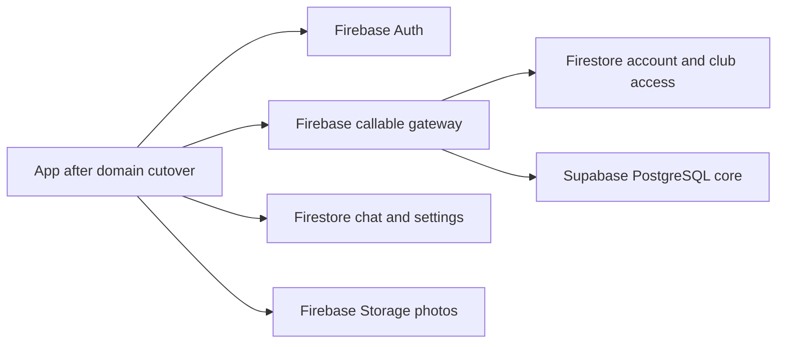

# Campus Cats data storage, database choices, and costs

Last updated: **October 5, 2026**. Provider pricing checked against official pages on that date. Prices are USD before tax, discounts, or promotional credits.

The accepted direction is **Supabase Free PostgreSQL for the connected application records, with Firebase retained for authentication, chat, settings, operations, photos, and hosting**. The reasons are query structure and data integrity. Recent usage does not justify a paid database subscription.

**Current production status:** the live app still reads and writes Firebase. Supabase contains a closed rehearsal copy of selected relational records. Its schema, indexes, read queries, staged catalog adapters, and favorite transaction are implemented; the remaining writers and live cutover are unfinished. The destination tables below describe the accepted design, not a claim that production traffic has already moved.

## 1. Evidence and scope

There are three different kinds of evidence:

| Evidence                                                                                                      | Date / window                              | What it establishes                                                                                           |
| ------------------------------------------------------------------------------------------------------------- | ------------------------------------------ | ------------------------------------------------------------------------------------------------------------- |
| [Production capacity assessment](database-capacity-assessment.md)                                             | September 2–October 2, 2026                | Firestore storage and recent operation counts for the production project                                      |
| [Source audit](database-source-audit.json) and [source manifest](../supabase/source-manifest.production.json) | Selected-domain export completed October 2 | Which legacy/root and club-scoped records were selected for rehearsal, and how duplicate imports were handled |
| [Hosted validation](database-hosted-validation.json)                                                          | October 5                                  | Actual staged PostgreSQL storage, entity counts, query checks, and closed client access                       |

The inventory also uses the repository's [collection definitions](../core/domain/persistenceCodecs.ts), feature modules, and server workflows. A supported feature does not prove that its production collection contains records. Counts are reported only where measured; unmeasured chat, billing, surveys, and voting counts are not assumed to be zero.

### Measured size and activity

| Measurement                                               |                      Observed value | Interpretation                                                                       |
| --------------------------------------------------------- | ----------------------------------: | ------------------------------------------------------------------------------------ |
| Production Firestore data plus indexes                    | 91,192,985 bytes, about **91.2 MB** | Entire measured database, including retained datasets and legacy copies              |
| Production document reads in the measured 30 days         |                          **81,404** | About 2,713/day on average; not a count of page views                                |
| Production document writes in the measured 30 days        |                          **54,573** | About 1,819/day on average                                                           |
| Largest aligned 24-hour read / write totals               |                 **14,497 / 13,500** | Monitoring windows do not match daily billing boundaries                             |
| Discovered collection-group records                       |                           **8,232** | Includes matching root/nested collections; duplicates can be counted twice           |
| Staged PostgreSQL application/private tables plus indexes |   **7,200,768 bytes**, about 7.2 MB | Selected relational slice, including allocated table/index overhead                  |
| Indexes within that PostgreSQL total                      |   **2,834,432 bytes**, about 2.8 MB | Already included in 7.2 MB; do not add them again                                    |
| Whole staged PostgreSQL database                          | **19,019,443 bytes**, about 19.0 MB | Includes database system overhead; differs from total server disk including WAL/logs |
| Applied PostgreSQL migrations                             |                               **5** | Catalog discovery, favorite transactions, and detail/media reads included            |

These are different scopes: **91.2 MB versus 7.2 MB does not mean PostgreSQL compressed the whole app by that ratio**. The SQL copy excludes the university directory, retained operational/chat records, image bytes, and duplicate imported entities. Neither storage number establishes monthly bandwidth, actual invoice charges, or live page latency.

### Measured business entities

| Dataset                        | Selected rehearsal records / measured inventory | Qualification                                                           |
| ------------------------------ | ----------------------------------------------: | ----------------------------------------------------------------------- |
| Local cat sightings            |                                              54 | Imported sightings are separate                                         |
| iNaturalist observations       |                                             626 | Tenant source selected; 622 root copies excluded                        |
| Local catalog entries          |                                              51 | Preserve individual local cats separately from guide taxa               |
| iNaturalist guide profiles     |                                              62 | Tenant facts selected; 62 root entity copies excluded                   |
| Stored catalog total           |                                             113 | Local plus imported rows                                                |
| Effective catalog list         |                                              67 | 46 explicit guide-to-local links replace duplicate local list rows      |
| Comments                       |                                             100 | Selected sighting-comment source; not every possible comment collection |
| Public profiles                |                                               3 | User accounts are a separate dataset                                    |
| User/membership source records |                                             162 | Rehearsal SQL access is disabled for all members                        |
| Feeding stations / alerts      |                                           8 / 3 | Selected root sources                                                   |
| Media references               |                                           1,594 | References, including imported photos; not 1,594 copied image files     |
| University directory           |                                           6,466 | Production collection-group count; retained in Firestore                |

There are 163 minimal SQL identity rows because one historical contributor is absent from the 162 current user records. Thirty-seven local sightings do not have a unique exact catalog-name match; their names are preserved and their catalog foreign keys remain null. The importer does not invent an identification.

## 2. Database type and provider are separate decisions

**SQL / relational:** tables, foreign keys, unique constraints, transactions, joins, and server-side aggregation. PostgreSQL is the chosen engine. Supabase is its current host; another PostgreSQL host could preserve this architecture.

**NoSQL / document:** collections of separately addressable documents, with related information assembled by queries, application code, or maintained summaries. Firestore supports transactions too; retaining a dataset there does not mean it lacks consistency requirements.

**Firebase Realtime Database is also NoSQL.** It stores a JSON tree; it is not Firebase's relational database. Firestore is a document database. Neither converts the current relationships into PostgreSQL-style tables simply by moving records between Firebase products. [Firebase database comparison](https://firebase.google.com/docs/database/rtdb-vs-firestore)

Firebase's PostgreSQL offering is now named **SQL Connect**, previously **Data Connect**, and uses Google Cloud SQL. It is an alternative SQL host/API combination, not an alternative name for Realtime Database. [Firebase SQL Connect](https://firebase.google.com/docs/sql-connect), [rename notice](https://firebase.blog/posts/2025/04/dataconnect-general-availability/)

Photos are **object storage**, and Firebase Auth is an **identity service**. Neither should be treated as an application SQL or document table containing image bytes or passwords.

## 3. Inventory: connected application records intended for SQL

Most current application collections are scoped under `clubs/{clubId}/…`; global accounts use `users/{uid}`. Legacy root copies also exist. Source ownership must be reconciled before cutover rather than importing every path as a different business entity.

The SQL names below match the implemented [migration files](../supabase/migrations/), rather than only the earlier conceptual table names in the ADR.

| Data the repo stores                       | Current Firebase collections / structure                                                                                     | Intended SQL structure                                            | Why SQL fits the actual access pattern                                                                                                                                           |
| ------------------------------------------ | ---------------------------------------------------------------------------------------------------------------------------- | ----------------------------------------------------------------- | -------------------------------------------------------------------------------------------------------------------------------------------------------------------------------- |
| Local sightings                            | `cat-sightings`: reported name, condition/details, observation time, coordinates                                             | `app.sightings`, nullable catalog relationship                    | Map/date queries, cat histories, and counts can be filtered and aggregated without sending all sightings to the phone                                                            |
| Private sighting/catalog contributors      | `content-contributors`, plus historical attribution fields                                                                   | `app_private.contributors`                                        | Explicit ownership joins support editing/privacy checks without returning contributor IDs in public content                                                                      |
| Local cat catalog                          | `catalog`: names, descriptions, residence, behavior, status, fur, sex, TNR, credits                                          | `app.catalog`                                                     | Relates to sightings, tags, favorites, comments, and photos; one query can produce a useful list page                                                                            |
| Imported observations and guide profiles   | `inaturalist-observations`, `inaturalist-guide-profiles`: source IDs, dates, taxa, links, visibility, overrides, attribution | `app.sightings`, `app.catalog`, private import extras             | Stable external IDs, explicit local links, and visibility filters support deduplication and combined lists; guide taxa remain distinct from individual cats                      |
| Catalog tags                               | `catalog-tag-settings`, `catalog-tag-assignments`                                                                            | `app.catalog_tags`, assignments, configuration/assignment markers | Many-to-many filters; explicit empty assignments must remain different from absent defaults                                                                                      |
| Favorite cats                              | `catalog-favorites`: one selected cat per member                                                                             | `app.catalog_favorites`                                           | Unique member selection, efficient cat heart counts, and transactional changes with retry receipts                                                                               |
| Public profiles and achievements           | `public-profiles`: display name, bio, photo, achievement IDs, selected title                                                 | `app.profiles`, `app.profile_achievements`                        | Public member queries and unique achievements; a selected title must reference an unlocked achievement                                                                           |
| Feeding stations                           | `stations`: location, supply/stock information, notes, known cats                                                            | `app.stations`                                                    | Structured map/location queries; free-text cat names are preserved unless an explicit relationship is established                                                                |
| Comments                                   | `sighting-comments`, `catalog-comments`, `station-comments`                                                                  | `app.comments` with actual parent foreign keys                    | Target/date pagination and parent cleanup; external attribution is separate from local member authorship                                                                         |
| Alerts and community events                | `alerts`, `community-events`: content, dates, location/attachments, audience policy                                          | `app.announcements`, separated by `kind`                          | Related content and time filtering; complete audience parity still needs gateway work before live use                                                                            |
| Read receipts                              | `alert-read-receipts`, `event-read-receipts`                                                                                 | `app.announcement_reads`                                          | One receipt per member/item and efficient unread checks                                                                                                                          |
| Surveys                                    | `community-surveys`: questions, options, publication/audience state                                                          | Surveys, questions, options tables                                | Parent/option relationships and structured reporting rather than increasingly large embedded arrays                                                                              |
| Survey submissions                         | `survey-responses`, `survey-submission-receipts`                                                                             | Responses, answers, answer-options; private receipts              | One submission per member, valid option/question relationships, and answers separated from anonymous participant identities                                                      |
| Contests and elections                     | `community-votes`, vote state/options/nominees/nomination receipts                                                           | Votes, options, nominees; private state/receipt metadata          | Phase/deadline checks and candidate relationships belong in server transactions; operational state currently preserved in private import metadata still needs writer integration |
| Ballots                                    | `community-vote-ballots`, `community-vote-ballot-receipts`                                                                   | `app.vote_ballots`, `app_private.vote_receipts`                   | Valid candidate/option foreign keys and one vote per account without exposing voter-to-ballot mappings in results                                                                |
| Public iNaturalist member links            | `inaturalist-public-links`                                                                                                   | `app.inaturalist_public_links`                                    | Links external attribution to a club member; OAuth tokens and verification attempts remain separate operational data                                                             |
| Photo/attachment references                | Firebase object paths or external photo URLs/metadata                                                                        | `app.media_references`                                            | Real parent links, profile/gallery roles, ordering, and external licenses; objects stay in Firebase or the external source                                                       |
| Imported moderation and migration metadata | `inaturalist-comment-moderation`, imported extras and source mappings                                                        | Private import metadata and migration-source tables               | Preserve provenance and visibility decisions; these private copies are not a completed replacement for moderation writers                                                        |
| SQL operation receipts and side effects    | New SQL infrastructure, not a migrated product collection                                                                    | Private mutation receipts, outbox, domain switches                | Content changes and their notification/billing work commit together; retries must not duplicate effects                                                                          |

JSONB is used **inside PostgreSQL** for private imported extras and bounded flexible metadata. Fields used for joins, ordering, counts, or constraints remain ordinary columns/tables. JSONB does not require introducing another document database.

Public profiles moving to SQL does not move login accounts. Historical identities are references, not new Firebase accounts. Receipt tables remain private even for officer results/export workflows.

## 4. Inventory: records and services retained in Firebase

These choices preserve working infrastructure while the connected core changes. Several retained datasets could also use SQL; retaining them is a scope and operational decision, not a claim that document storage is their only suitable design.

| Data / service                                | Retained location                                                                                                                      | Contents and reason                                                                                                                                                                               |
| --------------------------------------------- | -------------------------------------------------------------------------------------------------------------------------------------- | ------------------------------------------------------------------------------------------------------------------------------------------------------------------------------------------------- |
| Login accounts and sessions                   | Firebase Auth                                                                                                                          | Password/SAML login and token lifecycle; keep established authentication and account administration                                                                                               |
| Member administration                         | Firestore `users`, platform administration records                                                                                     | Club membership, roles, bans, consent/terms, account lifecycle; SQL receives minimal identity/membership projections, not credentials or full account documents                                   |
| Club access and provisioning                  | Firestore `clubs`, `access`, `club-onboarding-requests`, related setup/claim records                                                   | Current entitlement, maintenance, setup and ownership workflows remain authoritative                                                                                                              |
| Chat                                          | Firestore `chat-messages`, `chat-reactions`, `chat-restrictions`, `chat-ping-reads`                                                    | Existing realtime subscriptions, message history and read state; a SQL chat design is possible but would require replacing the current gateway/subscription behavior                              |
| Branding and privacy settings                 | Firestore `app-settings`                                                                                                               | Small club configuration document: logo/colors, contributor privacy and donation page; usually read together rather than joined into large reports                                                |
| Donation page                                 | Settings document; donation images in Cloud Storage                                                                                    | Title, description, external link and image references. The code rejects the future `direct` method; there is no in-app donation transaction ledger to migrate                                    |
| University directory and mappings             | Firestore `universities`, `university-clubs`, claims/overrides                                                                         | Existing onboarding search/provisioning; currently the largest measured collection by record count, which does not establish largest byte usage                                                   |
| Invitations, contacts, whitelist applications | Firestore, including `contact-info` and `whitelist`                                                                                    | Existing small administrative lookups, review workflows and email provisioning                                                                                                                    |
| Subscription billing                          | Firestore `billing-accounts`, club `billing-usage`, `billing-usage-events`, `billing-invoice-reconciliations`, `stripe-events`; Stripe | Subscription/invoice IDs, usage aggregates, retries and webhook deduplication. These are transactional workflows already implemented in Firestore; migrating them is not required for cat queries |
| Integration credentials and jobs              | Secret Manager, Functions, Firestore `integration-state`, `inaturalist-account-links`, `inaturalist-link-attempts`                     | Credentials, verification attempts, import checkpoints, notification/email jobs; after cutover, content import writers must target SQL                                                            |
| Account deletion jobs                         | Firestore `account-deletion-jobs`; Functions                                                                                           | Cleanup must eventually cover both stores and Firebase objects                                                                                                                                    |
| Uploaded photos, logos and attachments        | Firebase Cloud Storage                                                                                                                 | Image bytes, object delivery and upload validation; SQL stores their references                                                                                                                   |
| Billing reporting                             | Google Cloud billing export / BigQuery                                                                                                 | Existing officer/developer billing report; not the application content database                                                                                                                   |
| Hosting and execution                         | Firebase Hosting and Cloud Functions                                                                                                   | Keep web delivery, API execution and integrations                                                                                                                                                 |

An external donation site's payment records belong to that payment provider. If in-app donations are introduced, design a separate SQL transaction/refund/reconciliation model; that is future work, not a current dataset.

## 5. How structure and indexes are intended to improve queries

A catalog page needs names, tags, heart counts, sighting counts, recent dates, and covers. The legacy workflow assembles these from several datasets and can list Storage for each card. The staged SQL discovery query returns a bounded page with those fields; a supplied cover reference avoids that per-card Storage listing.

That improvement depends on using the new queries. A database copy by itself does not change the live screen's requests. SQL also needs measured query plans and sensible page limits; it does not automatically make every query fast.

| Query                          | Implemented supporting structure                                                                                    |
| ------------------------------ | ------------------------------------------------------------------------------------------------------------------- |
| Recent sightings and next page | `(club_id, observed_at DESC, id DESC)` for visible sightings                                                        |
| A cat's sighting history       | `(club_id, catalog_id, observed_at DESC, id DESC)`; imported guide/taxon date index                                 |
| Map viewport                   | Club/latitude/longitude bounds index and bounded reads; antimeridian handling. PostGIS/GiST remains a later step    |
| Catalog names                  | `(club_id, lower(name), id)` for visible local rows; linked/imported fields combined by the effective catalog query |
| Tag filtering                  | Reverse assignment index `(club_id, tag_id, catalog_id)`                                                            |
| Hearts and member selection    | Cat-count index plus unique `(club_id, user_id)` favorite key                                                       |
| Comments for a parent          | `(club_id, target_kind, target_id, created_at, id)`                                                                 |
| Gallery references             | Catalog owner, position and ID index; stable position/ID pagination                                                 |
| Survey/vote integrity          | Parent foreign keys, option/nominee indexes and unique participant receipt keys                                     |
| Pending side effects           | Partial outbox index for unprocessed work ordered by next attempt                                                   |

All tenant relationships include `club_id`; a club cannot link its content to another club's row. Contributor/participant identities are private. Current read RPCs are service-only, with application table access denied to anonymous and authenticated SQL roles. The Firebase server gateway derives club/user access from live account checks.

Substring search and sorting by calculated heart/sighting totals do not all become simple index-only queries. For this small dataset, bounded server aggregation is the initial design. Full-text/trigram indexes, persistent summaries, or additional geo indexes should follow measured query plans, not speculation. Extra indexes consume storage and add write work.

The initial gateway is planned to run through Firebase Functions:



This is the intended flow, not a diagram of an already-deployed SQL gateway. A request can incur Firebase authorization reads and execution/network usage as well as Supabase egress. SQL query counts are not a substitute for measuring the whole path.

## 6. Services, pricing models, and the current choice

### Selected SQL host: Supabase Free

| Item                             | Free                                                    | Pro, if later needed                                                                                   |
| -------------------------------- | ------------------------------------------------------- | ------------------------------------------------------------------------------------------------------ |
| Subscription                     | **$0/month**                                            | Starts at **$25/month**                                                                                |
| Database allowance               | 500 MB/project                                          | 8 GB disk/project; general-purpose excess $0.125/GB-month                                              |
| Compute                          | Shared CPU, 500 MB RAM                                  | Separately sized compute; one Micro approximately covered by the $10/month organization compute credit |
| Uncached database/network egress | 5 GB included                                           | 250 GB included; excess $0.09/GB                                                                       |
| API requests                     | No per-request fee; compute/resource limits still apply | Same distinction; larger compute may cost more                                                         |
| Inactivity and recovery          | Can pause after a week; own backup process needed       | No inactivity pausing; daily backups retained seven days                                               |

Sources: [Supabase pricing](https://supabase.com/pricing), [compute charges](https://supabase.com/docs/guides/platform/manage-your-usage/compute), [egress](https://supabase.com/docs/guides/platform/manage-your-usage/egress), [backups](https://supabase.com/docs/guides/platform/backups).

We are using PostgreSQL only, not buying Supabase Auth, Storage, or Realtime replacements. The cached Storage egress allowance is separate and should not be added to the database's uncached quota. The current server gateway does not use Supabase client authentication.

The measured 19.0 MB database is approximately 3.8% of a 500 MB allowance. This is capacity evidence for the staged slice, not a forecast of future clubs, transfer, or compute demand. Check the provider's aggregate database report too: our report measures one database, while the platform can account for other databases/system data. Database size and total disk/WAL usage are different metrics. [Database/disk size definitions](https://supabase.com/docs/guides/platform/database-size)

A Pro subscription would charge its base even if the application still stored only 7.2 MB of tables/indexes. Larger compute, another project, backups beyond the included recovery features, and excess usage can add costs. Do not upgrade based only on the current stored bytes.

### Selected document host: Firebase Firestore

| Item                                 | Relevant Firestore Standard quota / charge                                              |
| ------------------------------------ | --------------------------------------------------------------------------------------- |
| Fixed Firestore subscription minimum | No flat per-database subscription fee for ordinary usage                                |
| Free stored data/index allowance     | 1 GiB for the qualifying database                                                       |
| Free document operations             | 50,000 reads, 20,000 writes, 20,000 deletes **per day**                                 |
| Free outbound transfer               | 10 GiB/month                                                                            |
| Paid usage                           | Location-specific document/index reads, writes, deletes, storage, and outbound transfer |

Free operation quotas reset around midnight Pacific and apply to one qualifying database per project. They cannot be banked between quiet and busy days. Backups, PITR, TTL and other chargeable features require separate accounting. [Firestore billing rules](https://firebase.google.com/docs/firestore/pricing)

For the worked estimates below, Google's published **`nam5` example** uses **$0.06 per 100,000 reads, $0.18 per 100,000 writes, and $0.02 per 100,000 deletes**, plus **$0.18/GiB-month** above the storage allowance. These are reference rates, not an invoice quote; recheck the region-specific table before a purchase or migration. The production database is `nam5`, so using the pricing page's default Iowa table would give a different regional estimate. [Official `nam5` example](https://firebase.google.com/docs/firestore/billing-example), [location pricing](https://cloud.google.com/firestore/pricing)

The operation total can include index-entry batches, listener reconnects and rule-dependent reads as applicable. One screen load can read many documents; one query is not necessarily one billable read. [Firestore operation accounting](https://cloud.google.com/firestore/pricing)

### Retained services have separate meters

The hybrid project's bill also includes any applicable Firebase Functions/runtime/build/network, Cloud Storage storage/operations/downloads, Hosting transfer, authentication features, Secret Manager, scheduled work, BigQuery, and external integration fees. Keep those lines separate from database hosting. [Firebase pricing](https://firebase.google.com/pricing)

Cloud Storage now requires a Blaze billing plan to maintain access under Google's announced changes; that requirement does not itself prove a particular monthly charge. Bucket type, region and usage determine its applicable free allowances/rates. [Storage billing requirements](https://firebase.google.com/docs/storage/faqs-storage-changes-announced-sept-2024)

The existing [billing-report guide](billing.md) explains the Google Cloud export; [club billing operations](billing-operations.md) describe the separate Stripe subscription system. Supabase's invoice is outside the Firebase billing export. We have not verified a complete current platform invoice or photo-download total.

## 7. What this costs for our measured data

**Additional Supabase database hosting for the rehearsal: $0/month while within Free limits.** Existing Firebase and external costs continue. This is not a claim that the entire app costs zero.

The Firestore database is well below its free storage allowance. Average reads/writes and the measured aligned peaks are also below the corresponding daily thresholds. This supports low or zero ordinary database operation/storage charges, subject to actual billing-day usage and qualifying quotas. Egress, extra index reads and paid features were not fully established by the assessment.

For perspective, applying the reference read/write rates to all 81,404 reads and 54,573 writes **without any free operation allowance** gives about **$0.15** for those two counters. This illustrative calculation excludes all other charges and is not an estimate of the invoice. It demonstrates why those measured counters do not justify a $25 or $45 monthly database commitment.

There is no measured cost advantage requiring us to move low-volume Firestore data to a paid SQL plan. The accepted SQL pilot instead makes connected queries and constraints easier to implement while its incremental database hosting remains free.

There is also no inherent **$45/month cost for switching to PostgreSQL**. Paid managed SQL prices buy a provisioned service with compute/recovery/configuration overhead. Migration development and validation are a separate one-time effort; neither is priced simply by our row count.

## 8. How to calculate when switching becomes cheaper

### Compare the workload that actually moves

A $30 Firebase project bill does not imply SQL will save $30. Chat, photos, authentication, maps, email, hosting and retained billing records may account for most of it.

Use this comparison over a chosen number of months:

```text
F_before = Firestore charges with the current application workload
F_after  = Firestore charges for retained datasets plus SQL gateway authorization reads
S        = PostgreSQL host subscription + compute + storage + transfer
G_delta  = change in gateway/runtime/network charges
B_delta  = change in backup/recovery costs
M        = one-time migration and validation cost
H        = months over which migration effort is amortized

Switching is cheaper when:
F_before - F_after > S + G_delta + B_delta + M/H
```

This is an analysis rule, not a provider guarantee. Include the cost of maintaining denormalized Firestore summaries if that is the alternative design. Both before/after estimates must deliver equivalent features and privacy/recovery requirements.

### Database-operation illustration

For a 30-day example, calculate paid daily reads/writes/deletes separately:

```text
paid_reads   = sum over days: max(total_billable_reads_that_day - 50,000, 0)
paid_writes  = sum over days: max(total_writes_that_day - 20,000, 0)
paid_deletes = sum over days: max(total_deletes_that_day - 20,000, 0)

operation_cost = paid_reads / 100,000 * read_rate
               + paid_writes / 100,000 * write_rate
               + paid_deletes / 100,000 * delete_rate
```

The following are **our calculations**, using the reference `nam5` rates and an even daily workload. They assume the full free allowance is available to the compared workload and omit storage, transfer, backups, retained data, and gateway costs. They are not total-platform quotes.

| Assumed daily reads / writes | Calculated Firestore operations/month | What it suggests against a $25 SQL base                                          |
| ---------------------------- | ------------------------------------: | -------------------------------------------------------------------------------- |
| 2,713 / 1,819                |                                    $0 | Measured-average illustration; paying a SQL base cannot save on these operations |
| 100,000 / 10,000             |                                 $0.90 | Firestore operations remain inexpensive                                          |
| 1,000,000 / 10,000           |                                $17.10 | Still below the base before other charges                                        |
| 2,000,000 / 10,000           |                                $35.10 | Worth evaluating SQL if it can serve the workload within the assumed paid tier   |
| 10,000 / 100,000             |                                 $4.32 | Many writes can still cost less than the SQL base                                |
| 10,000 / 500,000             |                                $25.92 | Near the base; actual SQL write compute and effects must be measured             |

Using only one operation type, a $25 comparison is reached at roughly **1.44 million reads/day** or **483,000 writes/day**, including that operation's free daily allowance. These are arithmetic reference points, not migration triggers. Shared quotas already consumed by chat reduce the allowance available to other records; SQL gateway checks still consume Firestore reads. SQL compute/transfer limits can also be reached before this operation-only comparison becomes useful.

Do not divide a monthly read total by a monthly free allowance when traffic is uneven. A quiet month can still contain chargeable spikes.

## 9. When to keep, upgrade, or change services

| Situation                                                                                                | Cost implication                                                                               | Decision for this repo                                                                                                                          |
| -------------------------------------------------------------------------------------------------------- | ---------------------------------------------------------------------------------------------- | ----------------------------------------------------------------------------------------------------------------------------------------------- |
| Present size and recent activity                                                                         | Free SQL pilot and low-volume Firestore both have no demonstrated need for a database base fee | Keep the accepted hybrid direction and complete/test its integration                                                                            |
| Supabase Free meets resource/recovery needs, but some Firestore relational queries generate paid fan-out | Moving that workload may avoid operation charges without adding a SQL base                     | Measure the removable charge and gateway overhead; preserve one authoritative writer                                                            |
| SQL data remains small, but the app requires unattended recovery or cannot tolerate inactivity pausing   | Paid SQL could be justified by operations rather than storage                                  | Compare a paid service and equivalent backup/recovery arrangements; bytes alone are not the deciding factor                                     |
| Supabase usage approaches the Free boundary                                                              | PostgreSQL index/system growth and uncached transfer matter, even with few users               | Investigate at about 400 MB database size or 4 GB monthly uncached egress; these are our planning thresholds, not provider quotas               |
| SQL exceeds Free, while an equivalent document model would fit Firestore's allowances                    | A document design could have a smaller provider bill                                           | Include rewrites, extra reads, summary maintenance and integrity/privacy requirements; returning to Firestore is not a connection-string change |
| Firestore remains below a paid SQL base and SQL's additional features are no longer needed               | Firestore could be cheaper on recurring database fees                                          | Calculate migration payback before reversing the chosen model                                                                                   |
| A different PostgreSQL host quotes less for the same SQL workload                                        | Keep relational structure while changing the host                                              | Usually evaluate this before abandoning SQL only to avoid Supabase Pro                                                                          |
| A high-volume chat workload becomes expensive                                                            | Its listener/transfer pattern requires a separate comparison                                   | Compare equivalent realtime delivery, offline behavior, moderation, history and fan-out; do not move chat because a cat query is slow           |

For example, a hypothetical 600 MB PostgreSQL database would exceed Supabase Free. An equivalent Firestore database could still fit its storage allowance, but document/index overhead must be measured and the workload may incur operation charges. If that redesign only saves $25/month and costs $600 of effort, its simple payback is **24 months**, before extra operating costs. Those dollar inputs are assumptions, not measured project expenses.

## 10. Alternative services that preserve the SQL plan

### Firebase SQL Connect / Cloud SQL

Google currently advertises Cloud SQL pricing starting as low as **$9.37/month**, dependent on region/configuration. SQL Connect adds a separately metered service: on Blaze, 250,000 client operations/month are included, then $0.90/million; service egress has its own allowance. The Cloud SQL trial is temporary. [SQL Connect pricing](https://firebase.google.com/docs/sql-connect/pricing)

This corrects the idea that Firebase SQL always requires $45/month. An actual quote needs instance size, storage, backups, availability, network and API usage. The advertised starting configuration is not necessarily comparable to a Supabase paid instance or suitable for this app's required load.

It cannot beat an adequate **$0 SQL host** on database hosting fees. It could be cheaper than a later Supabase paid configuration if the all-in equivalent quote is lower. For illustration, an assumed $12/month equivalent deployment versus $25 saves $13/month; $156 of migration effort takes twelve months to recover. Validate the $12 assumption before treating that as a real choice.

Using SQL Connect would require its schema/connectors and gateway/authorization integration, or a separately implemented Cloud SQL access layer. Existing PostgreSQL records do not automatically become its app APIs.

### Neon PostgreSQL

Neon's October 2 announcement confirms a Free allowance of **1 GB/project** and **100 CU-hours/project/month**, with a six-hour restore window. At 0.25 CU, that allowance represents 400 active hours; 30 days continuously active would consume 180 CU-hours. [Official Free-plan update](https://neon.com/blog/neon-free-plan-1-gb-per-project)

If our SQL storage outgrew Supabase Free but remained below Neon's limit, and active compute fit that allowance, Neon could avoid a paid base while preserving PostgreSQL. Persistent import jobs or scattered traffic can change that compute result. Recheck its transfer, recovery and paid-plan terms at evaluation time; this guide does not quote a verified current paid Neon invoice.

Our initial gateway calls Supabase's PostgREST RPC API. A Neon switch would need a PostgreSQL connection/query adapter and another authorization/restore test, even though most tables, indexes and query logic are portable. It is not a zero-effort switch.

### Firebase Realtime Database

This is not an SQL alternative and is not selected for current datasets. Its billing emphasizes stored/downloaded bytes; the listed Blaze excess rates are $5/GB stored and $1/GB downloaded, with no-cost allowances calculated according to that product's rules. [Firebase pricing](https://firebase.google.com/pricing)

A compact, frequently updated presence/state dataset could warrant a separate comparison. Moving the existing connected records or chat history into a JSON tree does not by itself provide SQL joins or guarantee a lower bill.

## 11. Current implementation and conditions for live use

The detailed operational handoff is [supabase-setup.md](supabase-setup.md). At this document's date:

- Five schema migrations and the selected rehearsal import are applied.
- Bounded catalog discovery/detail/media/favorite queries and map/member/community summary queries pass hosted checks.
- Catalog discovery, picker, detail and favorite adapters exist behind an explicit integration option. Default app composition remains Firebase.
- The SQL favorite writer has transactional retry receipts and outbox behavior. Its live domain switch is disabled.
- Unsupported SQL-mode catalog create/update/delete operations are blocked before writing back to Firebase.
- The private backup restored successfully, with data and closed client RPC grants verified. Temporary rehearsal dumps are not a durable scheduled backup service.

Before cutover, implement the connected catalog/tag/sighting writers, import/moderation changes, contributor privacy parity, profile/membership updates, effects/outbox worker and account/media cleanup. Stations, comments and community submission gateways also remain. Register/deploy gateways, reconcile final sources, handle older clients that write Firestore, perform a consistent final import, and verify a write-aware rollback and durable backup process.

Do not make both stores independently editable for the same dataset. Retaining Firebase alongside SQL means dividing authority by dataset and maintaining deliberate projections, not duplicating all content with two competing writers.

## 12. How to revisit the cost decision

Re-evaluate monthly and before a paid upgrade:

1. Read the Firestore-specific SKU costs and daily usage, separating retained chat/operations from the candidate workload. Use the billing export rather than the total Google Cloud invoice alone.
2. Check PostgreSQL database/index size, actual query plans, compute/connections, and uncached egress. Include imports and backups in traffic accounting.
3. Measure the Firebase relay's authorization reads, execution time and transfer. Do not assume replacing document reads removes all Firebase usage.
4. Price equivalent recovery, availability and developer effort for Supabase, another SQL host, and any proposed document redesign.
5. Apply the cost/payback comparison in section 8 to a realistic workload. Document assumptions and a migration cost ceiling before changing providers.

The current decision remains **Supabase Free for the relational core and Firebase for the retained services**. A future paid plan or provider change should follow measured costs and requirements; current low data volume is not a reason to buy a paid base.

Related repository documents: [accepted ADR](architecture/0004-supabase-relational-core.md), [capacity assessment](database-capacity-assessment.md), [implementation handoff](supabase-setup.md), [behavior/privacy requirements](architecture/behavior-matrix.md), and [system design](architecture/system-design.md).
