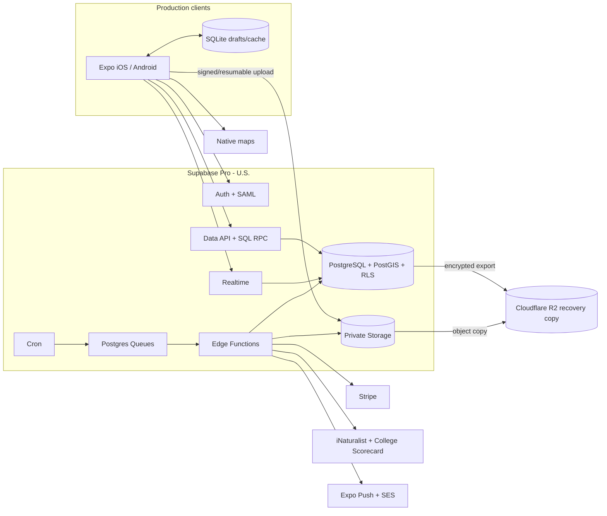

# System Design

| Field                     | Value                                                                                                                                             |
| ------------------------- | ------------------------------------------------------------------------------------------------------------------------------------------------- |
| Status                    | Proposed target architecture; greenfield choice and migration path are separate                                                                   |
| Owner                     | Campus Cats maintainers (specific owner TBD)                                                                                                      |
| Last updated              | 2026-08-27                                                                                                                                        |
| Primary recommendation    | Supabase Pro as a relational backend-as-a-service: PostgreSQL/PostGIS, Auth, RLS, Realtime, Storage, Edge Functions, Cron, and Queues             |
| Budget constraint         | USD 150/month hard ceiling before payment fees and labor; prefer USD 50/month or less at the projected year-one workload                          |
| Consequential assumptions | U.S. deployment; 10 clubs, 2,000 registered users, and 600 MAU in year one; English-only mobile app; one to three part-time volunteer maintainers |

This design starts from the product workload, volunteer ownership, and total cost. The current Firebase implementation is migration context, not the default answer. The previous AWS/RDS proposal is rejected because its private-networking and always-on database costs consume too much of the budget before serving a user.

## Contents

- [1. Context](#1-context)
- [2. Requirements](#2-requirements)
- [3. Design](#3-design)
- [4. Implementation Breakdown](#4-implementation-breakdown)
- [5. Risks, Open Questions, and Assumptions](#5-risks-open-questions-and-assumptions)

## 1. Context

### 1.1 Audience

Campus Cats is operated and used by university volunteers:

- Members report sightings, browse known cats, check feeding stations, and receive club updates, usually from a phone while moving around campus.
- Officers manage cats, stations, announcements, events, surveys, voting, and moderation in spare time rather than as paid operators.
- Presidents manage access, settings, succession, onboarding, and club billing.
- A very small maintainer group handles releases, incidents, backups, provider configuration, and support.

Production support is limited to iOS and Android. Expo web is a local development and smoke-testing convenience, not a deployed product.

The audience changes the architecture:

- low and predictable cost is a product requirement because infrastructure competes with food, shelter, and veterinary spending;
- managed services and one consolidated control plane are preferable to infrastructure that needs routine patching or on-call expertise;
- intermittent mobile connectivity requires durable drafts, safe retries, and resumable uploads;
- the system is not safety-critical, so expensive high-availability infrastructure is inappropriate unless clubs later fund it;
- exact locations, member identity, moderation, ballots, and billing metadata still require strong isolation and recovery.

### 1.2 Current Solution and Problem

Without the app, sightings, cat histories, feeding-station status, and time-sensitive updates are fragmented across people and communication channels. That causes duplicate entry, stale information, uncertain responsibility, and weak access control.

The repository currently implements Expo clients that access Firebase Auth, Firestore, and Cloud Storage, with Cloud Functions for privileged operations and integrations. It proves the product workflows and provides strong mobile realtime/offline behavior. Its main architectural pressures are relational:

- cats, tags, favorites, sightings, contributors, comments, users, roles, surveys, ballots, and billing state are related across collections;
- foreign-key, uniqueness, and multi-entity invariants are repeated in application code, Functions, and Security Rules;
- richer catalog filters, reports, and geospatial queries require composite indexes, denormalized projections, or client/server joins;
- direct provider access makes Security Rules part of the application API.

No repository evidence establishes production traffic, current cloud spend, media delivery, or query amplification. Capacity figures below are explicit planning assumptions.

### 1.3 Proposed Solution

Campus Cats gives each university club an isolated mobile workspace for photo-backed sightings, a searchable cat catalog, feeding-station status, community coordination, role-aware administration, university onboarding, imports, and subscription billing.

The solution must preserve relational integrity without requiring volunteers to operate a conventional server/database/network stack. It deliberately excludes a production web client, emergency response, veterinary medical records, a public social network, and general-purpose payment processing.

## 2. Requirements

### 2.1 Functional Requirements

| ID    | Priority | Capability and acceptance boundary                                                                                              |
| ----- | -------- | ------------------------------------------------------------------------------------------------------------------------------- |
| FR-1  | Must     | A visitor can find an existing club and see login branding without reading private club content.                                |
| FR-2  | Must     | A verified school-domain President can use one expiring invitation to create exactly one club and initial President membership. |
| FR-3  | Must     | Password or university SAML authentication derives membership and role from trusted data.                                       |
| FR-4  | Must     | Active Members read member-visible content only for authorized clubs.                                                           |
| FR-5  | Must     | A Member can safely retry a photo-backed sighting without duplicates or partial publication.                                    |
| FR-6  | Must     | Authorized roles manage catalog, stations, community content, access, moderation, settings, and billing according to policy.    |
| FR-7  | Must     | Media ownership, state, type, size, and key are transactional metadata; abandoned uploads are reconciled.                       |
| FR-8  | Must     | Notifications and provider side effects start only after durable content commits and remain replayable.                         |
| FR-9  | Must     | Surveys, nominations, ballots, reactions, role changes, and succession enforce phase and uniqueness transactionally.            |
| FR-10 | Must     | Moderation actions and their session/access effects are auditable.                                                              |
| FR-11 | Must     | iNaturalist imports remain attributed and read-only with local moderation.                                                      |
| FR-12 | Must     | Each club has isolated entitlement/subscription state; suspension does not delete data.                                         |
| FR-13 | Must     | Billing webhooks, imports, email, and push jobs are idempotent and expose failed work.                                          |
| FR-14 | Should   | Critical journeys expose accessible loading, success, empty, offline, validation, and partial-success states.                   |
| FR-15 | Should   | Maintainers can deploy, migrate, restore, roll back, inspect cost, and validate tenant isolation with documented automation.    |

### 2.2 Nonfunctional Requirements

#### Capacity model

| Metric                |                     Year one | Three-year threshold | Basis                                                      |
| --------------------- | ---------------------------: | -------------------: | ---------------------------------------------------------- |
| Clubs                 |                           10 |                   50 | Assumption                                                 |
| Registered users      |                        2,000 |               10,000 | 200 per club                                               |
| MAU / DAU             |                    600 / 200 |        3,000 / 1,000 | Assumption                                                 |
| Peak concurrent users |                           50 |                  250 | Event-driven burst                                         |
| Logical record reads  |                   30,000/day |          150,000/day | DAU × 5 sessions × 30 records                              |
| Mutations             |                      600/day |            3,000/day | DAU × 3                                                    |
| Peak request rate     |                         10/s |                 50/s | At least 20 times daily average                            |
| New media             | 500 files / 1.25 GiB monthly |     2,500 / 6.25 GiB | 2.5 uploads per DAU/month × 2.5 MiB                        |
| Structured storage    |                        10 GB |               100 GB | Conservative allowance including indexes and audit history |

| ID     | Target, scope, and rationale                                                                                                                |
| ------ | ------------------------------------------------------------------------------------------------------------------------------------------- |
| NFR-1  | Serve year one without separately provisioned database capacity, replicas, an application cache, or a separately operated API server.       |
| NFR-2  | Client list/detail p50 ≤800 ms, p95 ≤2.5 s, p99 ≤5 s; representative SQL p95 ≤250 ms.                                                       |
| NFR-3  | Non-media mutations p95 ≤3 s; compressed-image uploads expose progress, retry, and duplicate protection.                                    |
| NFR-4  | Target 99.0% monthly user-facing availability without a contractual SLA; maintenance communication is acceptable.                           |
| NFR-5  | Database and media RPO ≤24 hours and RTO ≤8 hours using managed backups and independent copies.                                             |
| NFR-6  | Retain seven daily database restore points and 30 days of encrypted logical exports; restore twice yearly.                                  |
| NFR-7  | Deploy in a U.S. region and keep production data in approved U.S. resources.                                                                |
| NFR-8  | Support maintained iOS and Android versions. Expo web is development-only.                                                                  |
| NFR-9  | Apply WCAG 2.2 AA principles and native guidance to VoiceOver/TalkBack, text scaling, contrast, reduced motion, and touch targets.          |
| NFR-10 | Use standards-based auth, PostgreSQL RLS, least-privilege grants, TLS, managed encryption, audit events, and secret isolation.              |
| NFR-11 | Exclude credentials, SAML assertions, OAuth tokens, Stripe secrets, ballots, moderation details, and precise locations from logs/analytics. |
| NFR-12 | Rate-limit anonymous and mutation workflows; validate images/payloads; bound query size and job concurrency.                                |
| NFR-13 | Alert on errors, slow queries, failed jobs, backup/export age, usage thresholds, and spend.                                                 |
| NFR-14 | Product analytics may be daily and exclude sensitive content and identity.                                                                  |
| NFR-15 | Hard production ceiling: USD 150/month before Stripe and labor. Preferred year-one total: USD 50/month or less.                             |

## 3. Design

### 3.1 Design Summary and Principles

#### Current state

Firebase remains a credible realtime/offline document platform, but the domain has enough relationships and transactional invariants to prefer relational storage in a greenfield design.

#### Preferred greenfield target

Use Supabase Pro as a relational backend-as-a-service. The platform provides a full PostgreSQL database with RLS and PostGIS extensions, rather than a proprietary relational abstraction. ([database documentation](https://supabase.com/docs/guides/database/overview))

- PostgreSQL/PostGIS is the transactional source of truth.
- Supabase Auth provides password and SAML identity.
- the Data API serves bounded CRUD through grants and RLS;
- SQL functions and Edge Functions own privileged, multi-entity, webhook, and provider workflows;
- Realtime publishes selected committed changes;
- Storage holds private media with signed/resumable uploads;
- Cron and PostgreSQL Queues run scheduled and retryable work;
- managed backups provide seven daily restore points ([backup documentation](https://supabase.com/docs/guides/platform/backups));
- nightly encrypted logical exports and media copies go to Cloudflare R2.

This preserves PostgreSQL joins, constraints, transactions, text search, and geospatial queries without an always-on RDS instance, NAT gateway, API Gateway, or separate identity/queue stack.

#### Migration-aware recommendation

Migrate by domain, not by provider all at once. Supabase has first-class support for trusting Firebase Auth JWTs across its Data API, Storage, Realtime, and Functions ([third-party authentication documentation](https://supabase.com/docs/guides/auth/third-party/overview)). Move relational data first; migrate Auth and media only after the model is stable. Every domain has one authoritative writer.

#### Market comparison

Planning ranges use the year-one workload and official pricing checked 2026-08-27. They include the application services needed, not just a database headline price.

| Candidate                    | Year-one total | Query fit                                                        | Included capabilities                                               | Main drawback                                                                         | Verdict                           |
| ---------------------------- | -------------: | ---------------------------------------------------------------- | ------------------------------------------------------------------- | ------------------------------------------------------------------------------------- | --------------------------------- |
| Supabase Pro                 |         $35–50 | PostgreSQL/PostGIS, joins, constraints, RLS                      | Auth/SAML, API, Realtime, Storage, Functions, Cron, Queues, backups | No automatic offline data cache; objects need separate backup                         | **Selected**                      |
| Firebase Blaze               |          $5–25 | Document queries/transactions; application-managed relationships | Auth/SAML, realtime/offline, Storage, Functions                     | Relational queries/invariants require denormalization and coordinated rules/functions | Strong non-relational alternative |
| Neon Launch + Cloudflare     |         $25–50 | Serverless PostgreSQL                                            | Database/Auth plus separately assembled Workers/R2/etc.             | More providers and custom integration                                                 | Strong modular alternative        |
| Cloudflare Workers + D1 + R2 |         $15–30 | Relational SQLite, low usage cost                                | Compute, SQL, objects, queues                                       | External SAML/Auth, no PostGIS, custom realtime/API                                   | Cheapest SQL, not best total fit  |
| Appwrite Pro                 |         $25–40 | Tables/document model; dedicated PostgreSQL extra                | Auth, Storage, Functions, Realtime, backups                         | Application SAML unavailable; weaker relational fit                                   | Rejected                          |
| Railway app + PostgreSQL     |         $25–60 | Full PostgreSQL                                                  | Flexible compute/storage                                            | Auth, objects, realtime, backups, and app operations remain ours                      | Rejected                          |
| Turso plus API/storage/auth  |         $15–35 | SQLite/libSQL                                                    | Database only                                                       | Weaker concurrency/geospatial fit; assembled stack                                    | Rejected                          |
| AWS RDS stack                |        $81–180 | Full PostgreSQL/PostGIS                                          | Mature managed components                                           | Database/network/telemetry fixed costs dominate                                       | Rejected                          |
| Small VPS                    |         $10–30 | Full control                                                     | Anything self-hosted                                                | Patching, backups, failover, and incidents fall on volunteers                         | Rejected                          |

Official sources: [Supabase](https://supabase.com/pricing), [Firebase](https://firebase.google.com/pricing), [Neon](https://neon.com/pricing), [Cloudflare Workers](https://developers.cloudflare.com/workers/platform/pricing/), [D1](https://developers.cloudflare.com/d1/platform/pricing/), [R2](https://developers.cloudflare.com/r2/pricing/), [Appwrite](https://appwrite.io/pricing), [Railway](https://docs.railway.com/pricing), and [Turso](https://turso.tech/pricing).

### 3.2 Architecture Diagram



No production web client, custom API server, NAT gateway, Redis, OpenSearch, Kubernetes, read replica, or multi-region deployment is selected.

### 3.3 End-to-End Request and Data Flows

#### Authentication and tenant context

1. Supabase Auth authenticates password or SAML users. During migration, Supabase accepts Firebase Auth JWTs through its supported third-party integration.
2. PostgreSQL maps the immutable subject to users and club memberships.
3. Grants and RLS restrict every query by membership, state, role, and club.
4. High-risk actions use a narrow SQL RPC or Edge Function that rechecks actor and target transactionally.

#### Catalog read

1. The app requests a bounded page from the Data API or stable SQL function.
2. PostgreSQL joins entries, cats, tags, favorites, and newest linked sighting.
3. B-tree indexes serve tenant/status/name ordering, GIN serves text search, and join indexes serve tags.
4. Keyset pagination avoids offsets; signed media URLs avoid public objects.
5. The app stores a bounded read cache for degraded/offline viewing.

#### Sighting and media

1. The app stores a local draft and requests an authorized upload.
2. It uploads compressed media directly to private Storage with progress/retry.
3. One RPC transaction creates the sighting, links, media metadata, audit event, and queue work using an idempotency key.
4. The draft clears only after receiving the committed server identifier.
5. A queue worker copies each committed object to R2; nightly reconciliation removes abandoned uploads and checks the primary/recovery manifests.

#### Privileged and asynchronous work

Roles, bans, succession, surveys, and voting run in transactions with locks and database constraints. Chat commits before Realtime publication. Queue consumers call Expo Push, SES, Stripe, and import providers with bounded retry. Stripe webhooks verify signatures and claim unique provider event IDs.

### 3.4 Component Decisions

| Component      | Current                        | Target                                                       | Why                                                        | Alternative/trigger                                         |
| -------------- | ------------------------------ | ------------------------------------------------------------ | ---------------------------------------------------------- | ----------------------------------------------------------- |
| Mobile         | Expo + Firebase adapters       | Expo + Supabase adapters + SQLite drafts/cache               | Preserves UI and intermittent field work                   | Platform-specific apps only after material divergence       |
| Data boundary  | Firestore + callable Functions | Data API for CRUD; RPC/Edge Functions for privilege          | No always-on API bill; server-enforced contracts           | Dedicated API for external clients/complex orchestration    |
| Store          | Firestore                      | Supabase PostgreSQL/PostGIS, FKs, constraints, RLS           | Relational/geospatial fit inside bundled low-cost platform | Neon if Supabase limits/regions fail                        |
| Identity       | Firebase Auth                  | Supabase Auth greenfield; trust Firebase during migration    | Integrated SAML; avoids immediate identity migration       | Keep Firebase Auth if moving it has no benefit              |
| Media          | Firebase Storage               | Supabase Storage, private immutable keys, signed/TUS uploads | 100 GB storage and 250 GB egress included                  | Move primary media to R2 when overage >$10/month            |
| Realtime       | Firestore listeners            | Realtime only for chat/high-value status                     | Included quota; SQL remains durable truth                  | Poll when freshness is not worth complexity                 |
| Offline        | Firestore persistence          | SQLite drafts, pending work, bounded cache                   | Covers interruption without general conflict engine        | Expand only from observed failures                          |
| Jobs           | Functions/work records         | Queues + Cron-triggered Edge Functions                       | Included, durable, replayable                              | External queue after platform limits                        |
| Search         | Firestore/local filters        | PostgreSQL GIN/trigram and tag joins                         | No search service bill/sync                                | Dedicated search above 100k rows/tenant or failed relevance |
| Recovery       | Provider durability            | Seven daily backups + incremental encrypted R2 copies        | Avoids $100/month PITR while limiting provider loss        | PITR only with funded sub-day RPO                           |
| Communications | SendGrid + Expo                | SES + Expo Push                                              | Near-zero use cost, no NAT                                 | Keep SendGrid for proven reputation/tooling                 |

### 3.5 Data Placement and Lifecycle

| Data                    | Access/integrity                  | Selected source                               | Lifecycle/recovery                             |
| ----------------------- | --------------------------------- | --------------------------------------------- | ---------------------------------------------- |
| Credentials/sessions    | Sign-in/revoke/SAML               | Supabase Auth; Firebase during transition     | Revoke then delete per policy                  |
| Clubs/memberships/roles | Tenant joins and unique state     | PostgreSQL, FKs, partial uniqueness, RLS      | Daily backup/export; pseudonymize by policy    |
| Catalog/tags/favorites  | Read-heavy changing joins/search  | PostgreSQL B-tree/GIN and unique join indexes | Daily backup/export and explicit cascades      |
| Sightings/locations     | Time/geospatial history           | PostgreSQL/PostGIS and GiST                   | Location retention TBD; reconcile media        |
| Stations/comments       | Current state plus history        | PostgreSQL tenant/time indexes                | Retain by club policy                          |
| Community/voting/chat   | Phases, unique receipts, realtime | PostgreSQL normalized rows plus bounded JSONB | Published votes immutable; retention TBD       |
| Moderation/audit        | Restricted and append-only        | Private schema/views and narrow RPCs          | Approved retention only                        |
| Media metadata          | Ownership/state/key               | PostgreSQL media_assets                       | Backup and presence reconciliation             |
| Media objects           | Byte-heavy direct transfer        | Supabase Storage; R2 recovery copy            | Immutable keys, pending TTL, deletion manifest |
| Imports/billing/jobs    | Provider IDs, idempotency, retry  | PostgreSQL + Queues                           | Rebuild imports; retain finance records        |
| Device drafts/cache     | Local pending/read-only state     | Expo SQLite                                   | Purge after commit/logout/TTL                  |

### 3.6 Scaling, Reliability, and Failure Behavior

Year-one average load is about 0.35 reads/s and 0.007 writes/s. Likely bottlenecks are unindexed RLS, N+1 client calls, unbounded histories, large images, and excessive subscriptions—not database capacity. Use keyset pagination, selected columns, indexed policy predicates, compressed media, bounded topics, and idempotency.

| Failure                   | Detection                 | Impact              | Mitigation                                                        |
| ------------------------- | ------------------------- | ------------------- | ----------------------------------------------------------------- |
| Supabase outage           | Synthetic auth/read/write | Core unavailable    | Preserve drafts, retry safely, communicate, verify after recovery |
| Slow SQL/RLS              | Query/client p95          | Slow lists/timeouts | EXPLAIN, indexes, bounds, eliminate N+1                           |
| Upload interruption       | Client/pending age        | Draft not published | Resume/retry; expire orphans                                      |
| Function/provider failure | Error and queue age       | Side effect delayed | Durable queue, idempotency, backoff, replay                       |
| Realtime outage           | Channel/reconnect errors  | Live updates stale  | Reload/poll durable SQL history                                   |
| Database/object loss      | Counts/manifests          | Missing content     | Restore daily backup/R2 copy and validate                         |
| Usage spike               | Quota/spend alerts        | Throttle or bill    | Tenant limits, compression, disable nonessential live topics      |

### 3.7 Security and Privacy

- Enable RLS on every exposed table, revoke default grants, and define policies per operation.
- Keep service-role credentials only in Edge Function secrets; clients receive publishable keys and JWTs.
- Include club identity in tenant foreign keys to block cross-club references.
- Use reviewed security-definer functions with a safe search path for privileged transactions.
- Keep buckets private; validate upload ownership, size, MIME type, and immutable path.
- Encrypt OAuth/provider tokens and audit role, ban, succession, onboarding, billing, and destructive actions.
- Exclude exact locations, messages, ballots, emails, and moderation reasons from analytics/logs.

### 3.8 Observability and Analytics

Track operation, club surrogate, actor role, result, error class, correlation ID, duration, query/function, queue message, retry, and provider—never content or secrets.

| Signal               | Alert                                                                 |
| -------------------- | --------------------------------------------------------------------- |
| Synthetic read/write | Three failures in five minutes or availability <99.0%                 |
| Client/API           | p95 above targets for 15 minutes or error ratio >2%                   |
| PostgreSQL           | Slow-query/RLS regression, connection pressure, storage >70% included |
| Realtime/functions   | Usage >70% included or failures >2%                                   |
| Jobs                 | Oldest work >10 minutes or two missed schedules                       |
| Recovery             | Export/object manifest older than 30 hours                            |
| Cost                 | Forecast at $25, $40, $50, and 80% of hard ceiling                    |

Do not add a paid warehouse or analytics platform at launch.

### 3.9 Decision Summary and Evolution Path

| Decision | Initial                                         | Revisit                                                   |
| -------- | ----------------------------------------------- | --------------------------------------------------------- |
| Platform | Supabase Pro                                    | Limitation, support/region failure, or base forecast >$75 |
| Database | PostgreSQL/PostGIS                              | Remains portable via SQL migrations/exports               |
| Access   | Data API/RLS + RPC/Functions                    | Dedicated API for public versioning/orchestration         |
| Media    | Supabase Storage + R2 copy                      | R2 primary when overage >$10/month                        |
| Identity | Supabase greenfield; Firebase during transition | Keep Firebase if migration has no benefit                 |
| Realtime | Selected topics                                 | Poll if complexity/usage outweighs freshness              |
| Async    | Queues + Cron/Functions                         | External queue after duration/concurrency limits          |
| Recovery | Daily backup + nightly copy                     | PITR only with funded sub-day RPO                         |
| Budget   | Prefer ≤$50; hard ceiling $150                  | Funding decision before a step change                     |

## 4. Implementation Breakdown

### 4.1 Delivery Sequence

1. Measure Firebase reads, listeners, storage, transfer, SAML MAU, and cost.
2. Create Supabase staging, SQL migrations, RLS/grant tests, local stack, alerts, and R2 recovery.
3. Configure Firebase JWT trust and prove cross-tenant denial.
4. Pilot catalog/tags/favorites/linked sightings for one test club and compare query plans/results.
5. Backfill, shadow-read, freeze briefly, checksum, and switch one domain with one writer.
6. Migrate field, identity/roles, and community domains through the same bounded cutover.
7. Move integrations to Queues, Cron, and Edge Functions; prove retry/replay.
8. Move media after metadata ownership is stable; enable R2 copying.
9. Decide independently whether Auth migration earns its cost.
10. Decommission Firebase domains only after rollback/recovery expiry.

### 4.2 Component Implementation

Prices are USD/month, checked 2026-08-27.

| Component             | Product                                  | Build/test                                                          |                                                                                  Base |
| --------------------- | ---------------------------------------- | ------------------------------------------------------------------- | ------------------------------------------------------------------------------------: |
| Mobile                | Expo/React Native + SQLite               | Supabase adapters, drafts/cache, interruption/accessibility tests   |                                                                     $0 plus store/EAS |
| Platform              | Supabase Pro U.S.                        | Production project, quotas, migrations                              |                                      $25–30 ([pricing](https://supabase.com/pricing)) |
| SSO                   | Supabase Auth                            | 50 included, then $0.015; 600 ≈ $8.25                               | $8.25 ([pricing](https://supabase.com/docs/guides/auth/enterprise-sso/auth-sso-saml)) |
| Database/API          | PostgreSQL/PostGIS + Data API/RPC        | Schema, grants, RLS, indexes, plans, races                          |                                                                 About $0.25 over 8 GB |
| Compute/realtime/jobs | Edge Functions, Realtime, Queues, Cron   | Signatures, timeouts, duplicates, replay                            |                                                                      Included at base |
| Primary media         | Supabase Storage                         | Private TUS uploads, signatures, orphans                            |                                                 Included through 100 GB/250 GB egress |
| Recovery              | Cloudflare R2                            | Nightly encrypted SQL exports, incremental object copy, and restore |    About $1.35/100 GB copy ([pricing](https://developers.cloudflare.com/r2/pricing/)) |
| Email/push            | SES + Expo Push                          | Sender, templates, receipts, invalid tokens                         |                                                                                   <$1 |
| Maps                  | Native Google/Apple SDK                  | Restricted keys and device tests                                    |                                                                                    $0 |
| Monitoring            | Supabase plus synthetic/client free tier | Alerts, privacy, budget                                             |                                                                                  $0–5 |
| Billing               | Stripe                                   | Hosted UI, signed webhook, reconciliation                           |                                                                         Variable fees |

### 4.3 API, Schema, and Job Boundaries

Generated APIs handle selected, bounded CRUD. Stable SQL functions expose create_sighting_with_media, submit_survey_response, submit_ballot, transfer_presidency, moderate_member, and claim_setup_request.

Schema groups cover tenancy, catalog/field work, community/voting, and operations/integrations. Every tenant table includes club_id; tenant-aware foreign keys prevent cross-club links.

```sql
CREATE INDEX catalog_active_name
  ON catalog_entries (club_id, status, lower(display_name), id);
CREATE INDEX catalog_search
  ON catalog_entries USING GIN (search_vector);
CREATE UNIQUE INDEX catalog_tag_unique
  ON catalog_entry_tags (club_id, catalog_entry_id, tag_id);
CREATE INDEX sightings_by_cat_recent
  ON sightings (club_id, cat_id, observed_at DESC, id);
CREATE INDEX sightings_location
  ON sightings USING GIST (location);
```

Every job has a stable idempotency key and is archived/deleted only after its external result and local projection commit safely.

### 4.4 Infrastructure, Environments, and Delivery

- Local uses Supabase CLI containers, provider adapters, Expo devices/emulators, and SQLite.
- CI runs code checks, migrations, RLS/grant tests, RPC races, provider contracts, and Firebase emulator tests during migration.
- Development may use a pausable Free project; production uses non-pausing Pro.
- Infrastructure is versioned SQL, Supabase configuration, Edge Functions, secrets manifests, R2 policy, provider manifests, and alerts.
- Deploy expand-compatible schema before functions/client; contract only after rollback expiry.
- Restore drills use a temporary project and synthetic validation accounts.

### 4.5 Cost Model

The repository contains no approved dollar budget. This design treats the prior USD 150 assumption as a hard ceiling and adds a preferred USD 50 target because the operator is volunteer-run.

| Cost                   |   One club | Year-one base |                      Three-year planning |
| ---------------------- | ---------: | ------------: | ---------------------------------------: |
| Supabase Pro/compute   |     $25–30 |        $25–30 |                                  $50–100 |
| SAML SSO               |    $0–2.25 |         $8.25 |                                   $44.25 |
| Database overage       |         $0 |         $0.25 |                      $11.50 plus compute |
| Primary storage/egress |         $0 |            $0 |  $20–80; move to R2 before large overage |
| R2 copy/later primary  |       $0–1 |         $1.35 |                                About $15 |
| Functions/Realtime     |         $0 |            $0 |                                    $5–30 |
| Email/push/maps        |       $0–1 |          $0–2 |                                    $2–10 |
| Monitoring             |       $0–3 |          $0–5 |                                    $5–20 |
| **Production total**   | **$25–37** |    **$35–50** | **$153–311 before optimization/funding** |
| Non-production         |         $0 |          $0–5 |                                    $5–25 |

Base arithmetic:

- Pro: $25–30.
- SSO: (600 − 50) × $0.015 = $8.25.
- Database: (10 GB − 8 GB) × $0.125 = $0.25.
- 100 GB media and 100 GB egress fit the listed 100 GB/250 GB allowances.
- R2 copy: (100 GB − 10 GB free) × $0.015 = $1.35 before small operation charges.

The base is about $35–50/month, roughly 55–75% below the rejected AWS base, without relying on a production free tier. Stripe, stores/EAS, taxes, labor, and optional PITR are excluded.

Guardrails:

- do not enable approximately $100/month PITR under a 24-hour RPO;
- do not add custom domain, replica, larger compute, paid APM, or transformations without evidence;
- alert before included quotas are crossed;
- move primary media to R2 before overage exceeds $10/month;
- require funding review before $50 and architecture review before $100.

#### One-time migration cost

Assume 8–16 engineer-weeks for schema/RLS, adapters, backfill, cutovers, recovery, and hardening. Proceed only if relational correctness and maintainability justify that volunteer engineering cost; this does not change the greenfield winner.

### 4.6 Verification and Acceptance

| Area              | Evidence                                                               |
| ----------------- | ---------------------------------------------------------------------- |
| Market/cost       | Measured usage mapped to quotas; prices rechecked; alerts demonstrated |
| Catalog           | Query plans, no N+1, keyset pagination, SQL p95 ≤250 ms                |
| Integrity         | FK, uniqueness, races, idempotency, cross-tenant denial                |
| Mobile            | Draft persistence, upload resume, restart retry, duplicate prevention  |
| Media/recovery    | Signed access, validation, cleanup, R2 checksum, full restore          |
| Community/billing | Concurrent receipts/roles; duplicate Stripe; queue replay              |
| Security          | Threat model, RLS/grants, function review, secrets, rate limits        |
| Accessibility     | Physical iOS/Android assistive-technology tests                        |
| Migration         | Counts/checksums, shadow equivalence, writer ownership, rollback       |

## 5. Risks, Open Questions, and Assumptions

### Open questions

| Question                                                       | Impact                        | Validation                      |
| -------------------------------------------------------------- | ----------------------------- | ------------------------------- |
| Is $150 approved, and is $50 the right preferred target?       | Could change tier/recovery    | Club approval before commitment |
| What are observed Firebase usage and cost?                     | Validates migration economics | Instrument before pilot         |
| Which joins, filters, spatial queries, and reports are needed? | Validates SQL advantage       | Inventory before schema freeze  |
| Is a 24-hour RPO acceptable?                                   | PITR adds about $100/month    | Club decision                   |
| How often are users offline for more than a minute?            | Determines local sync scope   | Field measurement               |
| What are retention/deletion rules?                             | Affects schema/backups/cost   | Approve before broad onboarding |

### Material risks

| Risk                                   | Impact                  | Mitigation                                        |
| -------------------------------------- | ----------------------- | ------------------------------------------------- |
| Supabase becomes another default       | Wrong target            | Re-price finalists and prototype catalog/RLS      |
| Data API/RLS leak                      | Cross-tenant disclosure | Revoke grants, tests, tenant FKs, narrow RPCs     |
| Storage objects absent from DB backups | Image loss              | R2 copy, manifests, restore drill                 |
| Limited offline behavior               | Failed sightings        | SQLite drafts/outbox and resumable upload         |
| Permanent dual truth                   | Divergence              | One writer/domain and bounded cutover             |
| No contractual SLA/PITR                | Longer outage/data loss | Explicit SLO and independent exports              |
| Usage crosses quotas                   | Unexpected bill         | Compression, bounded realtime, alerts, R2 trigger |
| Platform lock-in                       | Hard migration          | Standard PostgreSQL, SQL exports, provider ports  |
| Volunteer SQL/RLS ownership            | Security mistakes       | Templates, tests, runbooks, narrow surface        |

### Assumptions

| Assumption                                      | Impact                              | Revisit                      |
| ----------------------------------------------- | ----------------------------------- | ---------------------------- |
| 10 clubs, 2,000 users, 600 MAU                  | Usage/SSO cost                      | Monthly metrics              |
| $150 is a ceiling, not a target                 | Rejects AWS fixed cost              | Budget approval              |
| Year one should be ≤$50                         | Selects bundled BaaS/daily recovery | Funding or stricter RPO      |
| Relational needs will grow                      | Supabase beats Firebase             | Catalog prototype            |
| 99.0% and 24-hour RPO suffice                   | Avoids paid HA/PITR                 | Outage or requirement change |
| One to three volunteers prefer managed services | Rejects VPS/assembled stack         | Funded ownership             |
| Compressed image ≤2.5 MiB                       | Storage/egress estimate             | First 500 uploads            |
